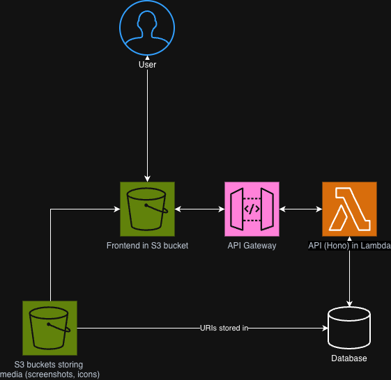

# Infrastructure proposal

My proposed infrastructure, deployed primarily on AWS, was chosen to satisfy these requirements:

- High availability
- Low cost
- Simple administration and maintenance

## Serving the frontend

This solution serves the frontend HTML/JS/CSS from an [S3 bucket](https://aws.amazon.com/s3/).
This is a very simple solution, and it means we don't have to maintain an actual web server.
The site is built by GitHub actions as part of our [CI/CD process](../processes/CI-CD.md), and automatically pushed to the bucket.

It is also a cheap solution, at well under $1USD per month.

The bucket is physically located in Melbourne, as presumably that will be where the majority of our visitors are located.
The client may wish to explore placing the frontend behind [Amazon CloudFront](https://docs.aws.amazon.com/AmazonCloudFront/latest/DeveloperGuide/Introduction.html), which will reduce latency to visitors around the world, but this will increase cost and may not be worthwhile.

## Serving the API

This solution serves the API as a [Hono app](https://hono.dev/) hosted on [AWS Lambda](https://docs.aws.amazon.com/lambda/latest/dg/welcome.html).

The client expects that traffic to the site will be relatively low.
Rather than pay for a server to run 24/7, Lambda's [serverlss paradigm](https://www.cloudflare.com/learning/serverless/what-is-serverless/) means that we will only pay when the API is accessed.
It also means we do not have to maintain the infrastructure (i.e. updating software, patching vulnerabilities).

In times of higher demand, AWS will automatically run more instances of the app to meet this demand.

Due to the relatively low anticipated access patterns, I also estimate backend costs at well under $1USD per month.

To run a self-managed server on [AWS EC2](https://aws.amazon.com/ec2/), we would likely be looking at a minimum of several USD for one server, plus upwards of $15USD for an [application load balancer](https://docs.aws.amazon.com/elasticloadbalancing/latest/application/introduction.html) to facilitate spinning up additional servers in periods of higher demand (plus the cost of those additional servers).

The backend is behind an [API Gateway](https://docs.aws.amazon.com/apigateway/latest/developerguide/welcome.html), simplifying some operations and providing a level of defence against malicious actions like DDoS attacks.

## Database

### Databases engines compared

I was asked to compare MySQL and PostgreSQL (Postgres) engines.
While they are [quite similar](https://aws.amazon.com/compare/the-difference-between-mysql-vs-postgresql/), Postgres is a more modern option.
The link above goes into detail about performance considerations, but with our low anticipated access patterns, both would perform very well.

Postgres natively supports data structure like arrays and objects, which may prove useful for our project.

I recommend that we go with Postgres.

### Managed vs self-managed database

Managed database services can be fairly expensive, even for our modest needs.
We might be tempted to save some money by self-managing the DB on, for example, EC2.
However, self-managing means that we will be responsible for maintaining and patching the database, and are at greater risk of data loss from misconfiguration.

### Recommendation

By using the [Supabase free plan](https://supabase.com/pricing), we can get a managed Postgres DB for zero-cost.
The included two active projects means that we can have a separate database in staging and production.

If the project is successful, the client may wish to transition to a service like [Amazon RDS](https://aws.amazon.com/rds/), but this starts at around $20USD per month.
