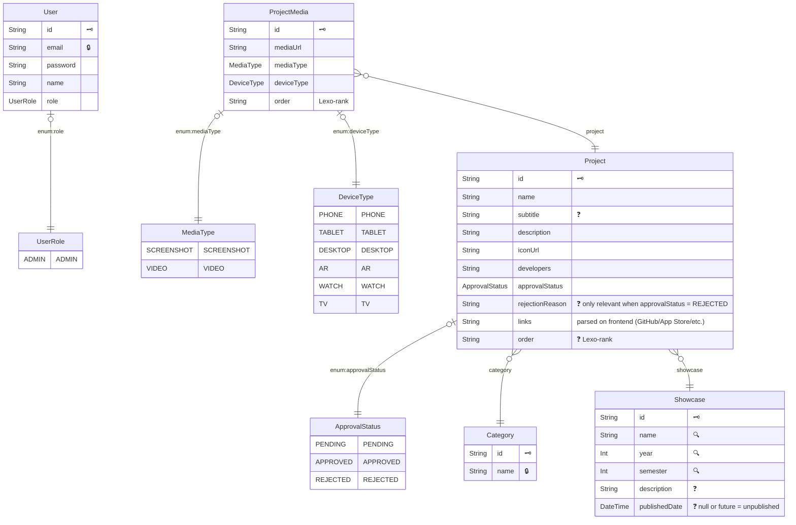

```mermaid
erDiagram

        UserRole {
            ADMIN ADMIN
        }
    


        MediaType {
            SCREENSHOT SCREENSHOT
VIDEO VIDEO
        }
    


        DeviceType {
            PHONE PHONE
TABLET TABLET
DESKTOP DESKTOP
AR AR
WATCH WATCH
TV TV
        }
    


        ApprovalStatus {
            PENDING PENDING
APPROVED APPROVED
REJECTED REJECTED
        }
    
  "Category" {
    String id "🗝️"
    String name "🔒"
    }
  

  "Showcase" {
    String id "🗝️"
    String name "🔍"
    Int year "🔍"
    Int semester "🔍"
    String description "❓"
    DateTime publishedDate "❓ null or future = unpublished"
    }
  

  "User" {
    String id "🗝️"
    String email "🔒"
    String password 
    String name 
    UserRole role 
    }
  

  "Project" {
    String id "🗝️"
    String name 
    String subtitle "❓"
    String description 
    String iconUrl 
    String developers 
    ApprovalStatus approvalStatus 
    String rejectionReason "❓ only relevant when approvalStatus = REJECTED"
    String links "parsed on frontend (GitHub/App Store/etc.)"
    String order "❓ Lexo-rank"
    }
  

  "ProjectMedia" {
    String id "🗝️"
    String mediaUrl 
    MediaType mediaType 
    DeviceType deviceType 
    String order "Lexo-rank"
    }
  
    "User" |o--|| "UserRole" : "enum:role"
    "Project" |o--|| "ApprovalStatus" : "enum:approvalStatus"
    "Project" }o--|| "Category" : "category"
    "Project" }o--|| "Showcase" : "showcase"
    "ProjectMedia" }o--|| "Project" : "project"
    "ProjectMedia" |o--|| "MediaType" : "enum:mediaType"
    "ProjectMedia" |o--|| "DeviceType" : "enum:deviceType"
```
