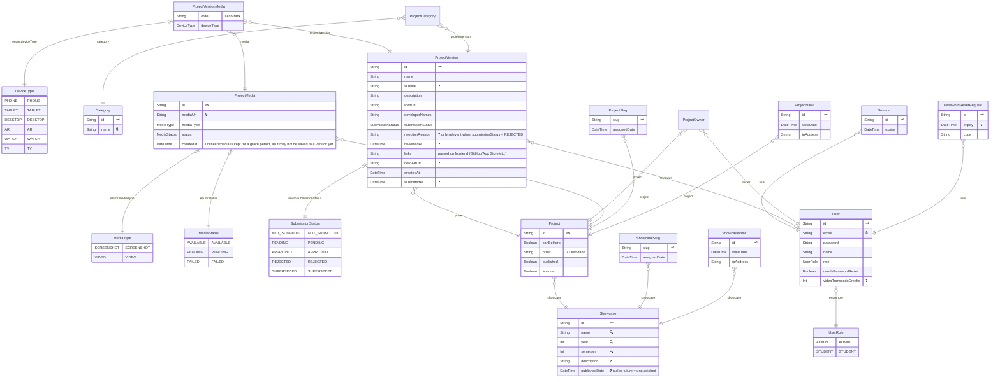

```mermaid
erDiagram

        UserRole {
            ADMIN ADMIN
STUDENT STUDENT
        }
    


        MediaType {
            SCREENSHOT SCREENSHOT
VIDEO VIDEO
        }
    


        MediaStatus {
            AVAILABLE AVAILABLE
PENDING PENDING
FAILED FAILED
        }
    


        DeviceType {
            PHONE PHONE
TABLET TABLET
DESKTOP DESKTOP
AR AR
WATCH WATCH
TV TV
        }
    


        SubmissionStatus {
            NOT_SUBMITTED NOT_SUBMITTED
PENDING PENDING
APPROVED APPROVED
REJECTED REJECTED
SUPERSEDED SUPERSEDED
        }
    
  "Category" {
    String id "🗝️"
    String name "🔒"
    }
  

  "Showcase" {
    String id "🗝️"
    String name "🔍"
    Int year "🔍"
    Int semester "🔍"
    String description "❓"
    DateTime publishedDate "❓ null or future = unpublished"
    }
  

  "User" {
    String id "🗝️"
    String email "🔒"
    String password 
    String name 
    UserRole role 
    Boolean needsPasswordReset 
    Int videoTranscodeCredits "❓"
    }
  

  "Session" {
    String id "🗝️"
    DateTime expiry 
    }
  

  "Project" {
    String id "🗝️"
    Boolean canBeHero 
    String order "❓ Lexo-rank"
    Boolean published 
    Boolean featured 
    }
  

  "ProjectVersion" {
    String id "🗝️"
    String name 
    String subtitle "❓"
    String description 
    String iconUrl 
    String developerNames 
    SubmissionStatus submissionStatus 
    String rejectionReason "❓ only relevant when submissionStatus = REJECTED"
    DateTime reviewedAt "❓"
    String links "parsed on frontend (GitHub/App Store/etc.)"
    String heroArtUrl "❓"
    DateTime createdAt 
    DateTime submittedAt "❓"
    }
  

  "ProjectOwner" {

    }
  

  "ProjectMedia" {
    String id "🗝️"
    String mediaUrl "🔒"
    MediaType mediaType 
    MediaStatus status 
    DateTime createdAt "unlinked media is kept for a grace period, as it may not be saved to a version yet"
    }
  

  "ProjectVersionMedia" {
    String order "Lexo-rank"
    DeviceType deviceType 
    }
  

  "ProjectCategory" {

    }
  

  "ProjectSlug" {
    String slug "🗝️"
    DateTime assignedDate 
    }
  

  "ShowcaseSlug" {
    String slug "🗝️"
    DateTime assignedDate 
    }
  

  "PasswordResetRequest" {
    String id "🗝️"
    DateTime expiry "❓"
    String code 
    }
  

  "ProjectView" {
    String id "🗝️"
    DateTime viewDate 
    String ipAddress 
    }
  

  "ShowcaseView" {
    String id "🗝️"
    DateTime viewDate 
    String ipAddress 
    }
  
    "User" |o--|| "UserRole" : "enum:role"
    "Session" }o--|| "User" : "user"
    "Project" }o--|| "Showcase" : "showcase"
    "ProjectVersion" }o--|| "Project" : "project"
    "ProjectVersion" |o--|| "SubmissionStatus" : "enum:submissionStatus"
    "ProjectVersion" }o--|o "User" : "reviewer"
    "ProjectOwner" }o--|| "Project" : "project"
    "ProjectOwner" }o--|| "User" : "owner"
    "ProjectMedia" }o--|| "Project" : "project"
    "ProjectMedia" |o--|| "MediaType" : "enum:mediaType"
    "ProjectMedia" |o--|| "MediaStatus" : "enum:status"
    "ProjectVersionMedia" }o--|| "ProjectMedia" : "media"
    "ProjectVersionMedia" }o--|| "ProjectVersion" : "projectVersion"
    "ProjectVersionMedia" |o--|| "DeviceType" : "enum:deviceType"
    "ProjectCategory" }o--|| "Category" : "category"
    "ProjectCategory" }o--|| "ProjectVersion" : "projectVersion"
    "ProjectSlug" }o--|| "Project" : "project"
    "ShowcaseSlug" }o--|| "Showcase" : "showcase"
    "PasswordResetRequest" }o--|| "User" : "user"
    "ProjectView" }o--|| "Project" : "project"
    "ShowcaseView" }o--|| "Showcase" : "showcase"
```
